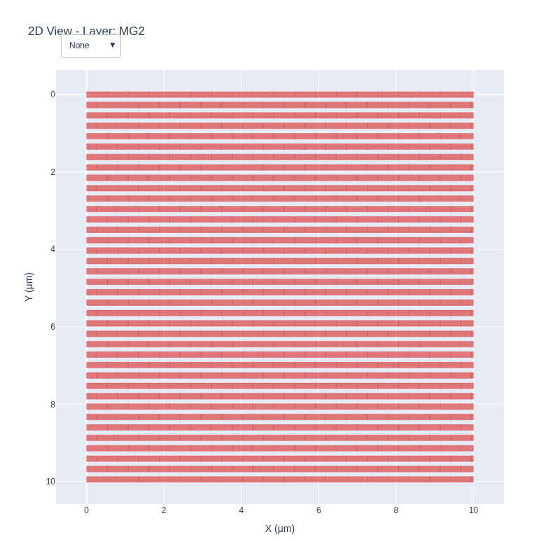

# Power/Ground Grid Netlist Generator

A Python-based tool for generating SPICE netlists and 2D interactive visualizations of power/ground grids for Back End Of Line (BEOL) metal stacks.

## Project Overview

This tool takes a YAML configuration file describing the metal layer stackup, materials, standard cells, and grid configuration. It then generates:

1.  A SPICE netlist model of the power/ground grid, including resistance and capacitance.
2.  A 2D interactive HTML visualization of the grid, allowing for layer-by-layer inspection.

## Features

*   **Configurable Grid Generation**: Define metal layers, via layers, and standard cell placement through a flexible YAML configuration.
*   **SPICE Netlist Output**: Generates a detailed SPICE netlist, accounting for metal segment resistance, via resistance, and plate/fringe capacitance to the substrate.
*   **Interactive 2D Visualization**: Produces an interactive Plotly HTML file, offering:
    *   A top-down 2D view of the power grid.
    *   Dropdown menu for selecting and viewing individual layers, or all layers at once.
    *   Initial view with no layers shown for a clean start.
    *   Layer ordering in the dropdown and legend that matches the physical BEOL stack (highest to lowest).
*   **Static Image Export**: Ability to export a static PNG image of any specified layer for documentation purposes.
*   **Python-based**: Built with Python 3.14, utilizing Pydantic for configuration validation, and Rich-Click for a user-friendly command-line interface.

## Installation and Usage

### Prerequisites

*   Python 3.14 or higher
*   `uv` package manager (recommended)

### Setup

1.  **Clone the repository**:
    ```bash
    git clone https://github.com/smprather/pg-grid-netlist-gen.git
    cd pg-grid-netlist-gen
    ```
2.  **Install dependencies and the project in editable mode**:
    This will create a virtual environment, install all required packages (including `kaleido` for static image export), and create the `pg_grid_netlist_gen` executable script.
    ```bash
    uv pip install -e .
    ```

### Running the Generator

The primary way to use the tool is through the `pg_grid_netlist_gen` executable script.

```bash
./pg_grid_netlist_gen generate <CONFIG_FILE> [OPTIONS]
```

**Example**:
```bash
./pg_grid_netlist_gen generate pg_grid_netlist_gen.yaml --open-browser --save-image MG2
```

This command will:
*   Use `pg_grid_netlist_gen.yaml` as the configuration.
*   Generate `output/power_grid.sp` (SPICE netlist).
*   Generate `output/power_grid.html` (interactive 2D visualization).
*   Automatically open `output/power_grid.html` in your web browser.
*   Save a static PNG image of the `MG2` layer to `output/MG2.png`.

## Configuration

The `pg_grid_netlist_gen.yaml` file defines the entire grid structure. Key sections include:

*   **`materials`**: Properties of conductive and insulating materials.
*   **`standard_cells`**: Definitions of standard cells to be placed, including pin names and dimensions.
*   **`grid`**: Specifies grid size, nets (VDD/VSS), and layer-specific configurations (type: `grid` or `staple`, direction, pitch, width).
*   **`beol_stack`**: Defines the physical layers of the Back End Of Line, including `metal` and `via` layers, their thickness, minimum width, and pitch, ordered from highest to lowest.

## Example Outputs

### 2D Interactive Visualization

The generated `power_grid.html` provides an interactive view. Below is a static image example of the `MG2` layer:



[Open the full interactive visualization (power_grid.html)](output/power_grid.html)

### SPICE Netlist Snippet

A portion of the generated `output/power_grid.sp` file:

```spice
* Power Grid Netlist - FreePDK15
* Generated by pg_grid_netlist_gen
* Grid: 10um x 10um
* Layers: 28

.subckt BUFX12 A Y VDD VSS
.ends BUFX12

* === Metal Segments (R) ===
* Layer: MG2
R_MG2_seg_0 MG2_X_0_Y_0 MG2_X_537_Y_0 237.7m
R_MG2_seg_1 MG2_X_537_Y_0 MG2_X_1075_Y_0 237.7m
R_MG2_seg_2 MG2_X_1075_Y_0 MG2_X_1612_Y_0 237.7m
R_MG2_seg_3 MG2_X_1612_Y_0 MG2_X_2150_Y_0 237.7m
R_MG2_seg_4 MG2_X_2150_Y_0 MG2_X_2688_Y_0 237.7m
R_MG2_seg_5 MG2_X_2688_Y_0 MG2_X_3225_Y_0 237.7m
R_MG2_seg_6 MG2_X_3225_Y_0 MG2_X_3763_Y_0 237.7m
R_MG2_seg_7 MG2_X_3763_Y_0 MG2_X_4300_Y_0 237.7m
R_MG2_seg_8 MG2_X_4300_Y_0 MG2_X_4838_Y_0 237.7m
R_MG2_seg_9 MG2_X_4838_Y_0 MG2_X_5376_Y_0 237.7m
R_MG2_seg_10 MG2_X_5376_Y_0 MG2_X_5913_Y_0 237.7m
R_MG2_seg_11 MG2_X_5913_Y_0 MG2_X_6451_Y_0 237.7m
R_MG2_seg_12 MG2_X_6451_Y_0 MG2_X_6988_Y_0 237.7m
R_MG2_seg_13 MG2_X_6988_Y_0 MG2_X_7526_Y_0 237.7m
R_MG2_seg_14 MG2_X_7526_Y_0 MG2_X_8064_Y_0 237.7m
R_MG2_seg_15 MG2_X_8064_Y_0 MG2_X_8601_Y_0 237.7m
R_MG2_seg_16 MG2_X_8601_Y_0 MG2_X_9139_Y_0 237.7m
R_MG2_seg_17 MG2_X_9139_Y_0 MG2_X_9676_Y_0 237.7m
R_MG2_seg_18 MG2_X_9676_Y_0 MG2_X_10000_Y_0 142.9m
```

## License

This project is licensed under the MIT License.
